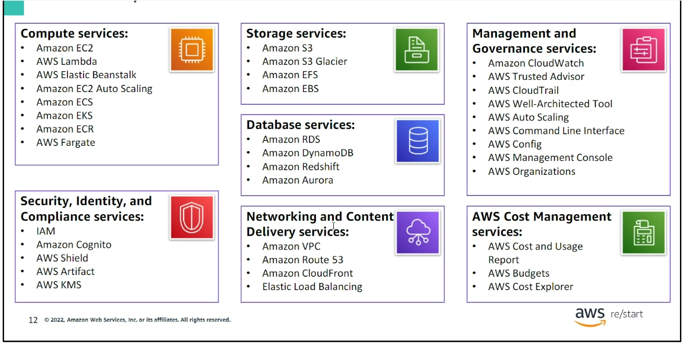

# Notes 01 February

1. Cloud Computing
   - On demand deliveryy of compute, database, storage, applications and other IT resources. These are deployed/delivered on a pay-as-you-go pricing model over the internet.
2. Cloud service models
   - IAAS (Infrastructure as a service)
     - Microsoft server
     - Linux server
   - PAAS (Platform as a service)
     - Code deployment (Netlify)
   - SAAS (Software as a service)
     - Facebook
     - Dropbox
3. Cloud deployment models
   - All-in-cloud
   - Hybrid
   - Private (on-premises)
4. Advantages of Cloud computing
   - Flexibity
   - Cost - Could be cheaper
   - Removes the need for physical resources
   - Security
5. Cloud adoption framework (CAF)
   - Business goals/ambitions/direcion
   - People
     - Leadership
     - Organizaion Structure
     - Sakeholders
   - Governance
   - Platform
     - Workloads, apps, etc.
   - Security
     - Encryption systems, etc.
   - Operations
     - Infrastructure setup

## AWS Services

