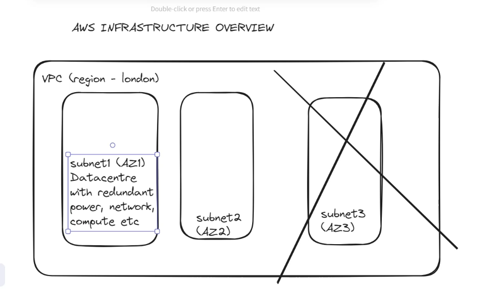

# Notes from 02 February

1. AWS Pricing
   - On-demand
   - NURI (No upfront reserved instance)
   - PURI (Partial upfront reserved instance)
   - AURI (All upfront reserver instance)
2. AWS Pricing Calculator
3. AWS Infrastructure

   - Regions are geographic locations which contain 2 or more availability zones.
   - Availability zones contain 1 or more data centers.
   - Data centers contain 50,000 to 80,000 servers.

   `Datacentres > Availability Zones > Regions`

   

4. AWS Services and Categories
   - Compute (EC2, Beanstalk, Lambda)
   - Storage (S3, EBS, EFS)
   - Container (ECS, EKS, ECR)
   - Network and content delivery (VPC, Cloudfront, ELB)
   - Governance (Cloudwatch, Cloudtrail, AWS config)
   - Security (IAM, AWS Org, Cognito, Artifact)
   - Database (RDS, DynamoDB, Aurora, Redshift)
