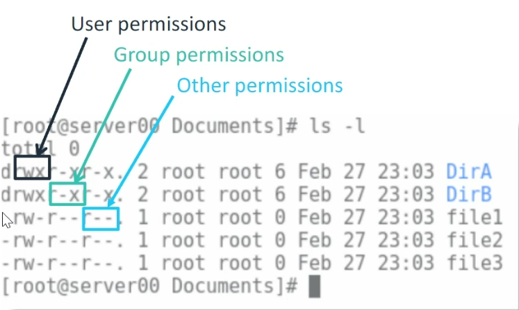

# Notes 08 Feb

1. Working with files and directories in Linux

   - In Linux everything is considered a file.

2. Common commands for managing and navigating files in Linux

   - `ls` Lists the files in the current directory
   - `ls -l` Lists the files in the current directory with details
   - `ls -R` Lists the files in the current directory with subdirectory contents
   - `cd` Change directory
   - `cp` Copy to another directory
   - `mv` Move to another directory (Can also be used to rename a file if used without directory name)
   - `rm` Delete file
   - `rm -r` Delete directory and content
   - `mkdir` Make directory
   - `touch` Make file
   - `rmdir` Remove directory
   - `history` Show history of commands used
   - `history >> newfile.txt` Put history of commands inside a text file

3. File compression in Linux

4. File permissions in Linux

   - Permissions for the owner, group, all
   - read (r), write (w) and execute (x)
     - read only
     - read and write
     - read, write and execute

